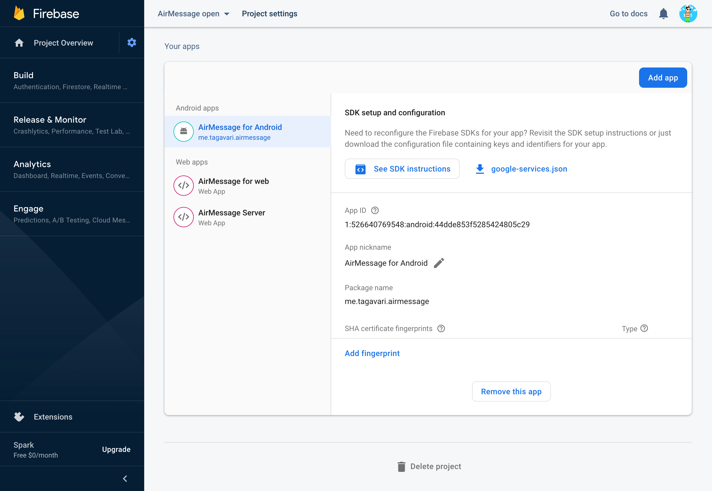

# AirMessage Connect (community edition)

AirMessage lets people use iMessage on the devices they like.
**AirMessage Connect** is a proxy service designed to lower the barrier to entry for new users by removing the need for port forwarding, as well as enabling support for clients in more restrictive environments like web browsers.

Other AirMessage repositories:
[Server](https://github.com/airmessage/airmessage-server) |
[Android](https://github.com/airmessage/airmessage-android) |
[Web](https://github.com/airmessage/airmessage-web)

## About this repository

This repository holds a Java implementation of AirMessage's Connect protocol over WebSockets.
It is less suitable for heavier workloads, but is rather designed to be used by developers to test their builds of AirMessage servers and clients over Connect.

Please note that this is the only purpose of this repository - to provide a public version of AirMessage Connect to developers.
This repository will only be updated to maintain compatibility with any changes to AirMessage's Connect protocol.

If you would simply like to test your build of an AirMessage client app over AirMessage Connect, you do not have to compile and run this program yourself.
A public server running AirMessage Connect (community edition) is available at `connect-open.airmessage.org` linked with a pre-configured Firebase project, and is available for anyone to use.
A fresh build of any of AirMessage's open-source apps will connect to this endpoint by default.

We kindly ask that you do not use AirMessage's primary Connect servers with any unofficial builds of AirMessage-compatible software.

## Getting started

To compile the program to a runnable JAR file, run `./gradlew shadowJar`, and locate the output file at `build/libs/airmessage-connect.jar`.
To compile and run directly from source, run `./gradlew run`. The program runs on port `1259` by default.

However, if you run the program without any additional configuration, the program will refuse to run.
AirMessage Connect tries to load 2 external files when it starts: an SSL certificate, and a Firebase configuration file.
Either of these file requirements can be explicitly ignored with the command-line arguments `insecure` and `unlinked` respectively.

Passing `insecure` will cause the server to run over `ws://` instead of `wss://`.
This is helpful for testing, but keep in mind that sites served over `https://` cannot connect to insecure `ws://` endpoints.

Passing `unlinked` will cause the program not to check accounts, and will disable push notifications.
The server will still validate client IDs (which are JKS tokens), but will not assess whether the account is actually valid.
Client IDs that start with `fake-` will bypass this check, and are useful for testing in environments where signing in with an account is not practical.

## Serving AirMessage Connect over a secure connection

Without the `insecure` argument, the program will look for an environment variable called `SERVER_CERTIFICATE`, and expects it to point to a `.pem` certificate file.

## Linking AirMessage Connect to a Firebase project

AirMessage Connect should be linked to a Firebase project to provide full functionality to its clients.
The program uses [Firebase Authentication](https://firebase.google.com/docs/auth), [Cloud Firestore](https://firebase.google.com/docs/firestore), and [Firebase Cloud Messaging](https://firebase.google.com/docs/cloud-messaging).
Please ensure that all of these services are set up in your project. You must also enable Google as a sign-in method for Firebase Authentication.

To link the program to a new Firebase project, you'll first have to download a private key for the Admin SDK.

Open the Firebase console and open **Settings** > **[Service Accounts](https://console.firebase.google.com/project/_/settings/serviceaccounts/adminsdk)**.
Then, click **Generate new private key**, then confirm and download your key.

Finally, save the private key somewhere to disk, and set it to an environment variable called `GOOGLE_APPLICATION_CREDENTIALS` when you run the program.
For more details, please see the Firebase help page: [Add the Firebase Admin SDK to your server](https://firebase.google.com/docs/admin/setup).

### Connecting client apps

To connect AirMessage client apps to your new server, you will have to update the AirMessage Connect endpoint, as well as link the app with your Firebase project.

For more details on adding client apps to your Firebase project, please see [Add Firebase to your Android project](https://firebase.google.com/docs/android/setup), or [Add Firebase to your JavaScript project](https://firebase.google.com/docs/web/setup).

AirMessage Server uses a JavaScript web app configuration in the Firebase console.
To configure AirMessage Server, open `connectauth/secrets.js` and set the exported constant `firebaseConfig` to your Firebase configuration object.
Update the AirMessage Connect endpoint by modifying the `connectEndpoint` property in `src/main/resources/secrets.properties`.

To configure AirMessage for Android, copy your downloaded `google-services.json` file to `app/google-services.json`.
Update the AirMessage Connect endpoint by modifying the `CONNECT_ENDPOINT` property in `secrets.properties`.

To configure AirMessage for web, open `src/secrets.ts` and update the constants `connectHostname`, `firebaseConfig`, `googleApiKey`, and `googleClientID`.
The last 2 values must be retrieved from the [Credentials page](https://console.developers.google.com/apis/credentials) in Google Cloud.
The `googleApiKey` must come from one of the listings under **API Keys**, and the `googleClientID` must come from a listing under **OAuth 2.0 Client IDs**.

---

Thank you for your interest in contributing to AirMessage!
You're helping to shape the future of an open, secure messaging market.
Should you have any questions, comments, or concerns, please shoot an email to [hello@airmessage.org](mailto:hello@airmessage.org).
